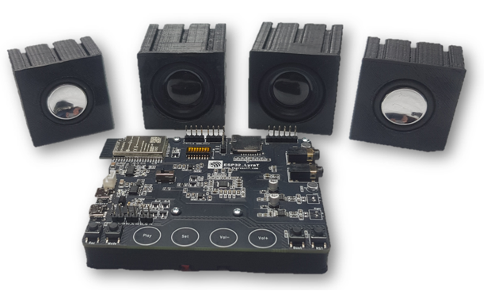
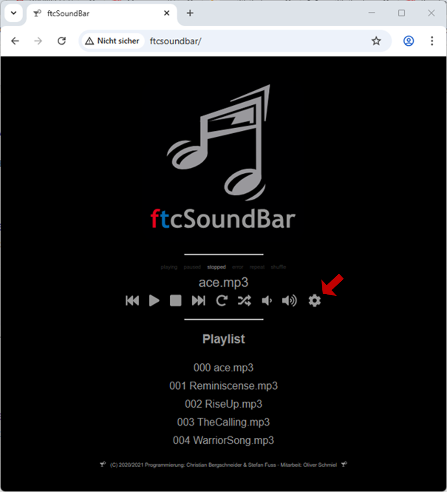
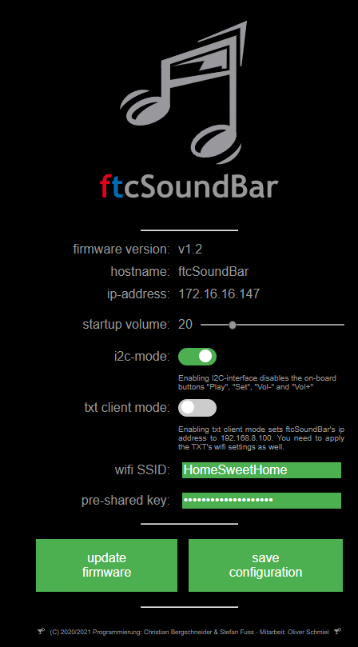

# The ftcSoundBar Project

ftcSoundBar is a sound card for fischertechnik TXT4.0/TXT/TX-Controllers, Arduino, ftDuino and Raspeberry based on an [espressif LyraT](https://www.espressif.com/en/products/devkits/esp32-lyrat) board.

It has multiple connectors, so yit could be used in various configurations:
- wifi based WEB-UI
- wifi based RESTAPI
- I2C-bus Interface (TXT, TXT4.0)



*Please checkout the article about ftcSoundBar in [ft:pedia 4/2020](https://ftcommunity.de/ftpedia/2020/2020-4/ftpedia-2020-4.pdf#page=73") as well.*

## New version 1.4 available!

ftcSoundBar now supports TXT4.0-Controllers and RoboProCoding. Additionally, in I2C-mode the ftcSoundBar don't need a wifi any more.

## Quick start

In a first step, run the ftcSoundBar standalone - just playing some fancy musik.


ftcSoundBars's configuration and your musik files are stored on a SD card. Please format a SD Card as FAT32 and store some mp3-files in the root folder. Additionaly, please create a text file named ```ftcSoundBar.conf``` and store it in the root folder as well:

```
WIFI=1
WIFI_SSID=<SSID>
WIFI_PASSWORD=<Password>
TXT_AP_MODE=0
I2C_MODE=1
DEBUG=0
STARTUP_VOLUME=15
HOSTNAME=ftcSoundBar
```

Add your wifi's SSID and Password and plug the SD card in the ftcSoundBars SD card slot. 

Connect your speakers with the fischertechnik/Maerklin plugs at the right side of the device. Alternatively, you yould use headphones  at the ```PHONEJACK```.

There are two micro USB connectors ```POWER``` and ```UART``` at the left side of the board. Connect ```POWER``` to an USB charger - with at least 1A -.

The devices starts, the green LED between CPU and DIP switched will start flashing. After some seconds, flashing stops. Your device is now connected to your wifi.

*Notice: if your device don't stops flashing after some seconds, please check your SD-Card and wifi settings in your ftcSoundBar.conf file.*

Enter ```http://ftcSoundBar``` in your browser to access the webUI of the ftcSoundBar. Using the marked setup- and ftcSoundBar icons you can flip between the main and the configuration view:

|  |  |
|---|---|
|  |  |

Try to play some songs on the main view.

*Notice: Maybe, you won't see the ```update firmware``` button in the configuration view. Don't worry  and read the firmware update section for more information.*

## Using your ftcSoundBar

Please check your prefreed controller and programm language. Follow up the links to get a short description how to use it.

| Controller | RoboProCoding | RoboPro     | C++ | Phyton |
|:----------:|:-------------:|:-----------:|:---:|:------:|
| TXT 4.0    | [i2c](./doc/ROBOProCoding-using-i2c-bus.md) |             |     |        |
| TXT        |               | [i2c bus](./doc/ROBOPro-using-i²c-bus.md)<BR>[local wifi](./doc/ROBOPro-using-local-wifi.md)<BR>[TXT AP mode](./doc/ROBOPro-using-TXT's-AP-wifi-mode.md) | | [cfw](./doc/CFW-and-python-using-wifi.md) |
| TX         |               | [i2c bus](./doc/fischertechnik-TX.md) | | |
| ftDuino    |               |             | [i2c bus](./doc/ftDuino.md) | |
| TX-PI      |               |             | | [local wifi](./doc/TX-PI.md) |
| RaspberryPi |               |             | | [local wifi](./doc/Raspberry-Pi.md) |
| Arduino ATMEL |            |             | [i2c bus](./doc/ATMEL-based-Arduino-boards.md) | |
| ESP        |               |             | [i2c bus](./doc/esp-32-family.md) | |


## Upgrade firmware

If you're upgrading the firmware the first time, please read the [firmware upgrade guide](./doc/Firmware-Upgrade.md).

Shortcut for experienced users:
- save `ftcSoundBar.bin` and `loader.bin`in the root folder of your SD card
- connect your ftcSoundBar to your local wifi
- Press `update firmware` button in the settings view

## Configuration File

| Option | Value | Description |
|:------:|:-----:|-------------|
| WIFI   | \[0|1\] | 1 - use wifi | 0 - shutdown wifi |
| WIFI_SSID | <string> | SSID of your local wifi |
| WIFI_PASSWORD | <string> | Password of your local wifi |
| TXT_AP_MODE | \[0|1\] | In most cases 0<br>set it 1 to use the TXT AP option |
| I2C_MODE | \[0|1\] | 0 - off <br> 1 - on |
| DEBUG | \[0|1\] | In standard 0. 1 to get additional debug information in the console log. |
| STARTUP_VOLUME | 0..100 | Speaker volume after reseting the device. |
| HOSTNAME | <string> | Set a different hostname than ftcSoundBar. Just needed to run 2 devices in the same wifi |

## Build your own ftcSoundBar

This Chapter describes how to build up your own ftcSoundBar from scratch. If you prefer to work with a prebuild system, you could purchase one at [www.gundermann.org](http://www.gundermann.org/shop). If you have already a ftcSoundBar please continue with chapter 2.

- [Build Hardware](Build-your-own-ftcSoundBar-hardware)
- [Build Software](Build-the-software)
