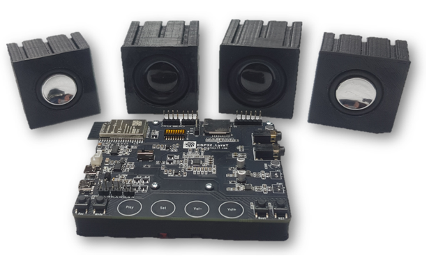

# ftcSoundBar

ftcSoundBar is a sound card for Arduino, ftDuino and fischertechnik TXT/TX-Controllers based on an <a href="https://www.espressif.com/en/products/devkits/esp32-lyrat">espressif LyraT</a> board.

It has multiple connectors, so you could use it in various configurations:
- wifi based WEB-UI
- wifi based RESTAPI
- I2C-bus Interface

Please checkout the <a href="https://github.com/elektrofuzzis/ftcSoundBar/wiki/">ftcSoundBar wiki</a> and the article about ftcSoundBar in <a href="https://ftcommunity.de/ftpedia/2020/2020-4/ftpedia-2020-4.pdf#page=73">ft:pedia 4/2020</a>.

# IMPORTANT

With firmware version V1.2 the I²C-interface was implemented in the ftcSoundBar's firmware. To get the interface running, the cabling of your ftcSoundBar board differs from the description in the ft:pedia article. Please refer to <a href="https://github.com/elektrofuzzis/ftcSoundBar/wiki/Build-your-own-ftcSoundBar">"Build your own ftcSoundBar"</a> for correct cabling.
