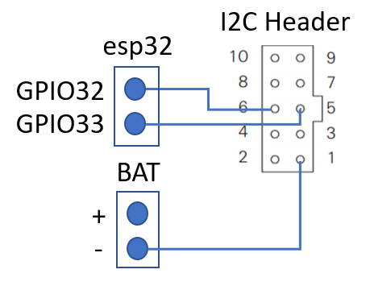
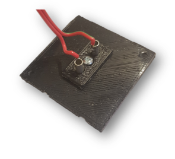
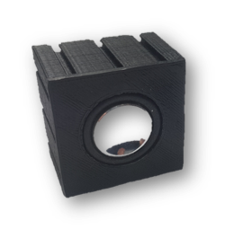

# Build your own Hardware

To build your own ftcSoundBar, you need a 3D printer and a soldering iron. If you don't have the needed equipment, you can purchase your ftcSoundBar at <a href="www.gundermann.org">http://www.gundermann.org/shop<a>

First, you need to organzize some components:
* 1 x <a href="https://www.espressif.com/en/products/devkits/esp32-lyrat">espressif LyraT</a>.
* 2 x <a href="https://www.puiaudio.com/products/as03104mr-n50-r">PUI audio speakers AS03104MR-N50-R</a>
* 1 x <a href="https://www.amphenol-icc.com/quickie-66506001lf.html">pin header / wire to board connecttor 10 positions"</a>
* 10 x tapping screws 2,2 x 4,5 mm
* 8 x <a href="https://www.fischerfriendswoman.de/index.php?p=7&sp=3#R7144">Bundhülse 8.4mm</a>
* 4 x cables with 2 cords (loud speakers)
* 1 x cable with 3 cords (i²c interface)

Download and print <a href="https://www.thingiverse.com/thing:4691172">speaker and ftcSoundBar case</a> at thingiverse

## ftcSoundBar

The lyraT board needs some simple modifications to get the I²C-connector and loud speaker connectors to the right side of the case:

<table>
<tr >
<td width="50%" height="300px"></td>
<td>At the front side of your LyraT board you need to remove the speaker connectors.  Add two cords of the i²c cable to GPIO32 and GPIO33 directly at the esp32-processor and fix it with some hot glue. The cables will be connected to the 10pos pin header in the ftcSoundBar case.</td></tr>

<tr><td width="50%" height="300px"></td><td>Remove the 4 pads.  Add 2 loud speaker cables from the rear side to connect to the "Bundhülse" which will be glued in the ftcSoundBar case.  Connect the last cord of the i²c cable to the "-" pin of the battery connector.</td> </tr>

<tr><td width="50%" height="300px"></td>
<td>Connect the i²c cable to the 10 pos pin header as shown on the left side.  The pin header is compliant with the 3.3V fischertechnik-TXT extention port - pin 1 GND, pin 5 SDA, pin 6 SCL.
</td></tr>

</table>

## Speaker box

Setting up the boxes is quite easy:
* Connect a 2 cords cable to the loud speaker. 
* Plug two "Bundhülse" into the mounting pad and solder the cords.
* Set the loud speaker in the case by turning it to the left.
* Tight the mounting plate with a screw to the rear cap.
* Screw the rear cap with the box case.

<table>
<tr>
<td height="300px"></td>
<td></td>
</tr>
</table>

