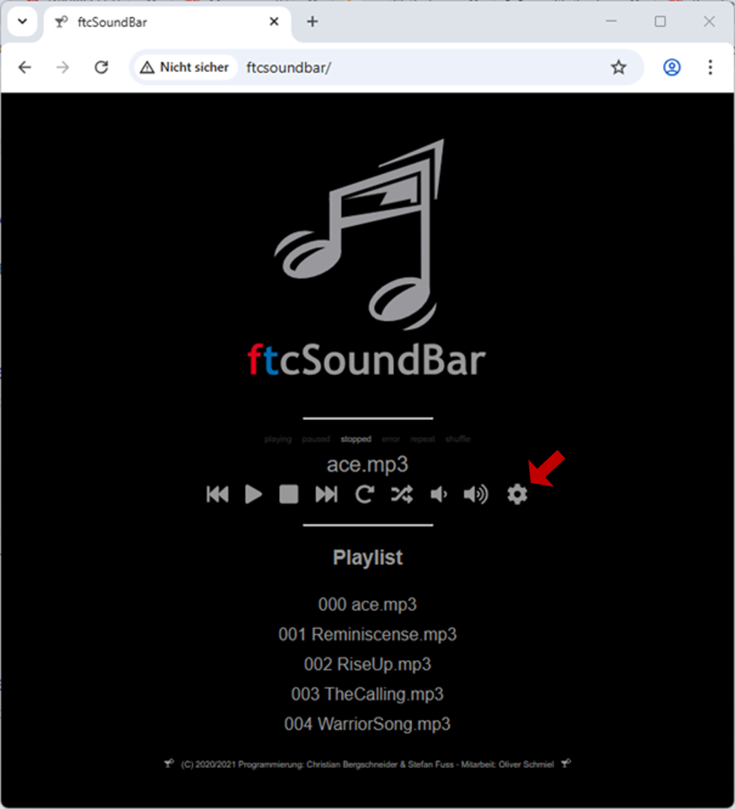
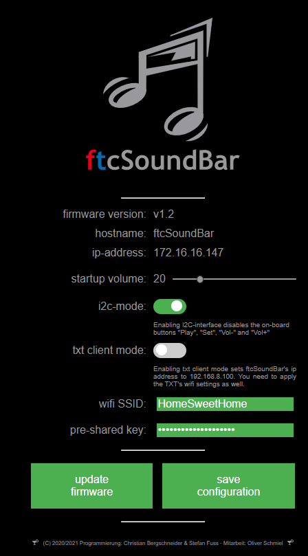

# Firmware Upgrade Guide

## Prerequisites

Download the files ftcSoundBar.bin and Loader.bin from GitHub.

Store both files on you ftcSoundBar's SD card.

Configure ftcSoundBar.conf to use wifi:

```
WIFI=1
WIFI_SSID=<SSID>
WIFI_PASSWORD=<Password>
TXT_AP_MODE=0
I2C_MODE=1
DEBUG=0
STARTUP_VOLUME=15
HOSTNAME=ftcSoundBar
```
Check the following parameters

- WIFI=1 - This parameter is new in version 1.4
- Fill WIFI_SSID with your wifi's name.
- Fill WIFI_PASSWORD with your wifi's password.
- TXT_AP_MODE=0
- HOSTNAME=ftcSoundBar

## Run the Upgrades

Plug the SD card  in your ftcSoundBar and press RESET.
Once the grenn LED stops blinking, the ftcSoundBar has connected to your wifi.
Enter ```http:\\ftcSoundBar``` in your browser:

{width=350}

Click the marked setup-button to change to the setup view:

{width=350}

With ```upgrade firmware``` you could now start the upgrade process.

During the upgrade, the green led flashes. Once it stops flashing, the firmware upgrade process succeeded. You could now call enter the ftcSoundBar in your browser again. Check the version number at the setup view.

*If you are missing the upgrade button, please check if both binary files ftcSoundBar.bin and loader.bin are stored at the SD card.*

## Follow up the upgrade porocess

Connect a USB cable to the UART port. You will now identify a new serial port at your PC.

Start a terminal program like putty and connect your serial interface with 115.200 Baud.

With clicking the update button, the process starts. In a first step ```loader.bin``` is flashed to the second partition:

```
I (25820) ftcSoundBar: Running partition type 0 subtype 16 (offset 0x00100000)
I (25830) ftcSoundBar: Writing to partition subtype 17 at offset 0x3b0000
I (25840) ftcSoundBar: data_read=1024
I (25850) ftcSoundBar: New firmware version: V1.31-dirty
I (25850) ftcSoundBar: Running firmware version: V1.31-dirty
I (26320) ftcSoundBar: esp_ota_begin succeeded
I (26340) ftcSoundBar: data_read=1024
I (26350) ftcSoundBar: data_read=1024

...

I (30130) ftcSoundBar: data_read=0
I (30130) ftcSoundBar: Total Write binary data length: 309760
I (30130) esp_image: segment 0: paddr=003b0020 vaddr=3f400020 size=11248h ( 70216) map
I (30170) esp_image: segment 1: paddr=003c1270 vaddr=3ffb0000 size=028f8h ( 10488)
I (30180) esp_image: segment 2: paddr=003c3b70 vaddr=40080000 size=0c4a8h ( 50344)
I (30210) esp_image: segment 3: paddr=003d0020 vaddr=400d0020 size=27b58h (162648) map
I (30280) esp_image: segment 4: paddr=003f7b80 vaddr=4008c4a8 size=03e5ch ( 15964)
I (30290) esp_image: segment 0: paddr=003b0020 vaddr=3f400020 size=11248h ( 70216) map
I (30330) esp_image: segment 1: paddr=003c1270 vaddr=3ffb0000 size=028f8h ( 10488)
I (30350) esp_image: segment 2: paddr=003c3b70 vaddr=40080000 size=0c4a8h ( 50344)
I (30370) esp_image: segment 3: paddr=003d0020 vaddr=400d0020 size=27b58h (162648) map
I (30440) esp_image: segment 4: paddr=003f7b80 vaddr=4008c4a8 size=03e5ch ( 15964)
I (30510) ftcSoundBar: Flashing firmware succeded.
I (30510) ftcSoundBar: Rebooting system in 5s
```

The loader now flashed the ftcSoundBar firmware to the other partition:

```
I (390) ftcSoundBar flash loader: **********************************************************************************************
I (400) ftcSoundBar flash loader: *                                                                                            *
I (410) ftcSoundBar flash loader: *                    Asymetric bootloader for flashing ftcSoundBar.bin.                      *
I (420) ftcSoundBar flash loader: *             (C) 2021 Oliver Schmiel, Christian Bergschneider & Stefan Fuss                 *
I (430) ftcSoundBar flash loader: *                                        Version v1.21                                       *
I (440) ftcSoundBar flash loader: *                                                                                            *
I (460) ftcSoundBar flash loader: * -> PLEASE BE PATIENT DRUING FLASH PROCESS. DON'T UNPLUG YOUR FTCSOUNDBAR UNTIL NOTICED! <- *
I (470) ftcSoundBar flash loader: *                                                                                            *
I (480) ftcSoundBar flash loader: **********************************************************************************************
I (490) ftcSoundBar flash loader:
I (500) ftcSoundBar flash loader: [1.0] Initialize peripherals management
I (510) ftcSoundBar flash loader: [1.1] Initialize and start peripherals
E (510) gpio: gpio_pullup_en(80): GPIO number error (input-only pad has no internal PU)
I (520) SDCARD: Using 1-line SD mode,  base path=/sdcard
I (530) AUDIO_THREAD: The esp_periph task allocate stack on internal memory
I (590) SDCARD: CID name SU02G!

I (1030) gpio: GPIO[22]| InputEn: 0| OutputEn: 0| OpenDrain: 0| Pullup: 1| Pulldown: 0| Intr:0
I (1030) ftcSoundBar flash loader: [2.0] Start flashing firmware
I (1030) ftcSoundBar flash loader: Running partition type 0 subtype 17 (offset 0x003b0000)
I (1040) ftcSoundBar flash loader: Writing to partition subtype 16 at offset 0x100000
I (1060) ftcSoundBar flash loader: data_read=1024
I (1060) ftcSoundBar flash loader: New firmware version: V1.31-dirty
I (1070) ftcSoundBar flash loader: Running firmware version: V1.31-dirty
I (3910) ftcSoundBar flash loader: esp_ota_begin succeeded
I (3930) ftcSoundBar flash loader: data_read=1024

...

I (21230) ftcSoundBar flash loader: data_read=0
I (21230) ftcSoundBar flash loader: Total Write binary data length: 1264224
I (21230) esp_image: segment 0: paddr=00100020 vaddr=3f400020 size=43ca8h (277672) map
I (21330) esp_image: segment 1: paddr=00143cd0 vaddr=3ffb0000 size=04344h ( 17220)
I (21340) esp_image: segment 2: paddr=0014801c vaddr=40080000 size=07ffch ( 32764)
I (21350) esp_image: segment 3: paddr=00150020 vaddr=400d0020 size=d2b04h (862980) map
I (21630) esp_image: segment 4: paddr=00222b2c vaddr=40087ffc size=11f08h ( 73480)
I (21660) esp_image: segment 0: paddr=00100020 vaddr=3f400020 size=43ca8h (277672) map
I (21750) esp_image: segment 1: paddr=00143cd0 vaddr=3ffb0000 size=04344h ( 17220)
I (21760) esp_image: segment 2: paddr=0014801c vaddr=40080000 size=07ffch ( 32764)
I (21780) esp_image: segment 3: paddr=00150020 vaddr=400d0020 size=d2b04h (862980) map
I (22060) esp_image: segment 4: paddr=00222b2c vaddr=40087ffc size=11f08h ( 73480)
I (22140) ftcSoundBar flash loader: Flashing firmware succeded.
I (22140) ftcSoundBar flash loader: Rebooting system in 5s
```

Afterwards the new firmware starts.